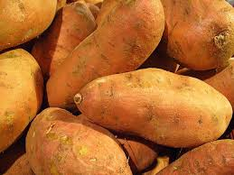
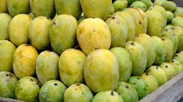
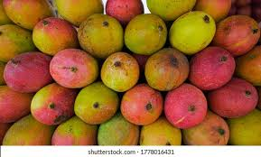
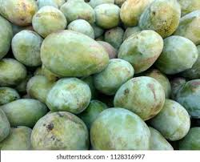
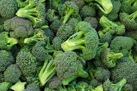
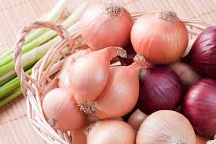

<!DOCTYPE html>
<html lang="en">
<head>
  <meta charset="UTF-8">
  <meta name="viewport" content="width=device-width, initial-scale=1.0">
  <title>Vegetable Shop</title>
  
  <link rel="stylesheet" href="https://cdn.jsdelivr.net/npm/bootstrap@5.3.3/dist/css/bootstrap.min.css">
  
</head>
<body>
<button class="btn btn-primary" onclick="window.location.href='checkout.html';">
  Go to Checkout
</button>

  <!-- Navbar with Cart Button -->
 <nav class="navbar fixed-top" style="background-color: #B6F2D1;">
    

      <a class="navbar-brand" href="#">Customer Dashboard</a>
      <button class="navbar-toggler" type="button" data-bs-toggle="offcanvas" data-bs-target="#offcanvasMenu" aria-controls="offcanvasMenu">
        
      </button>
      

        

          <h5 class="offcanvas-title" id="offcanvasMenuLabel">Navigation</h5>
          <button type="button" class="btn-close" data-bs-dismiss="offcanvas" aria-label="Close"></button>
        

        

          <ul class="navbar-nav">
            <li class="nav-item"><a class="nav-link" href="#">Home</a></li>
            <li class="nav-item dropdown">
              <a class="nav-link dropdown-toggle" href="#" id="productDropdown" role="button" data-bs-toggle="dropdown" aria-expanded="false">
                Product Types
              </a>
              <ul class="dropdown-menu" aria-labelledby="productDropdown">
                <li><a class="dropdown-item" href="vegetable.html">Vegetables</a></li>
                <li><a class="dropdown-item" href="meat.html">Meat</a></li>
                <li><a class="dropdown-item" href="dairy.html">Dairy</a></li>
              </ul>
            </li>
          </ul>
          <form class="d-flex mt-3" role="search">
            <input class="form-control me-2" type="search" placeholder="Search" aria-label="Search">
            <button class="btn btn-success" type="submit">Search</button>
          </form>
          

            <a href="cart.html" class="btn btn-primary w-100"><i class="fa-solid fa-cart-shopping"></i> Cart</a>
          

        

      

    

  </nav>

  body>
  

    

      <!-- Cabbage -->
      

        

          
          

            <h5 class="card-title"><b>Cabbage</b></h5>
            
Fresh Cabbage from the farm.

            

              <button class="btn btn-success add-to-cart" data-product="Cabbage" data-price="10">Add to Cart</button>
              

                <input type="number" class="form-control mx-2 quantity-input" value="0" min="0">
              

            

          

        

      

      <!-- Potato -->
      

        

          
          

            <h5 class="card-title"><b>Potato</b></h5>
            
Fresh Potato from the farm.

            

              <button class="btn btn-success add-to-cart" data-product="Potato" data-price="20/kg">Add to Cart</button>
              

                <input type="number" class="form-control mx-2 quantity-input" value="0" min="0">
              

            

          

        

      

      <!-- Sweet Potato -->
       

        

          
          

            <h5 class="card-title"><b>Sweet Potato</b></h5>
            
Fresh Sweet Potato from the farm.

            

              <button class="btn btn-success add-to-cart" data-product="Sweet Potato" data-price="100/kg">Add to Cart</button>
              

                <input type="number" class="form-control mx-2 quantity-input" value="0" min="0">
              

            

          

        

      

      <!-- Fajli Aam -->
       

        

          
          

            <h5 class="card-title"><b>Fajli Aam</b></h5>
            
Fresh Fajli Aam from the farm.

            

              <button class="btn btn-success add-to-cart" data-product="Fajli Aam" data-price="150/kg">Add to Cart</button>
              

                <input type="number" class="form-control mx-2 quantity-input" value="0" min="0">
              

            

          

        

      

      <!-- Himshagar Aam -->
       

        

          
          

            <h5 class="card-title"><b>Himshagar Aam</b></h5>
            
Fresh Himshagar Mango from the farm.

            

              <button class="btn btn-success add-to-cart" data-product="Himshagar Aam" data-price="200/kg">Add to Cart</button>
              

                <input type="number" class="form-control mx-2 quantity-input" value="0" min="0">
              

            

          

        

      

      <!-- Langra Aam -->
       

        

          
          

            <h5 class="card-title"><b>Langra Aam</b></h5>
            
Fresh Langra Mango from the farm.

            

              <button class="btn btn-success add-to-cart" data-product="Langra Aam" data-price="250/kg">Add to Cart</button>
              

                <input type="number" class="form-control mx-2 quantity-input" value="0" min="0">
              

            

          

        

      

      <!-- Eggplant -->
      < 

        

          
          

            <h5 class="card-title"><b>Eggplant</b></h5>
            
Fresh Eggplant from the farm.

            

              <button class="btn btn-success add-to-cart" data-product="Eggplant" data-price="32/kg">Add to Cart</button>
              

                <input type="number" class="form-control mx-2 quantity-input" value="0" min="0">
              

            

          

        

      

      <!-- Broccoli -->
       

        

          
          

            <h5 class="card-title"><b>Broccoli</b></h5>
            
Fresh Broccoli from the farm.

            

              <button class="btn btn-success add-to-cart" data-product="Broccoli" data-price="300/kg">Add to Cart</button>
              

                <input type="number" class="form-control mx-2 quantity-input" value="0" min="0">
              

            

          

        

      

      <!-- Onion -->
      

        

          
          

            <h5 class="card-title"><b>Onion</b></h5>
            
Fresh Onion from the farm.

            

              <button class="btn btn-success add-to-cart" data-product="Onion" data-price="150/kg">Add to Cart</button>
              

                <input type="number" class="form-control mx-2 quantity-input" value="0" min="0">
              

            

          

        

      

      <!-- Tomato -->
       

        

          
          

            <h5 class="card-title"><b>Tomato</b></h5>
            
Fresh Tomato from the farm.

            

              <button class="btn btn-success add-to-cart" data-product="Tomato" data-price="12">Add to Cart</button>
              

                <input type="number" class="form-control mx-2 quantity-input" value="0" min="0">
              

            

          

        

      

    

  

  

  
</body>
</html>
